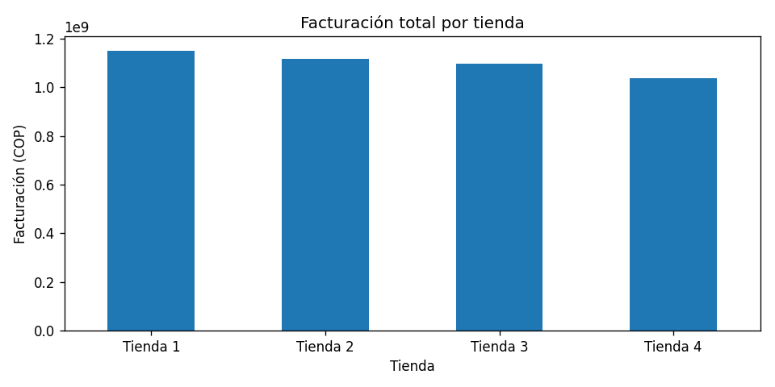
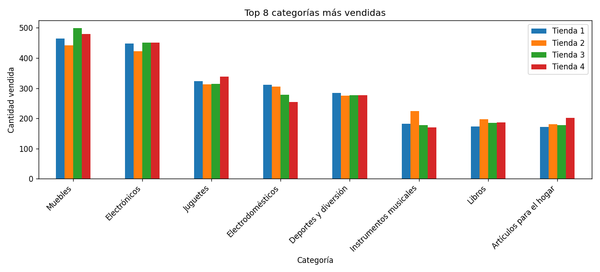
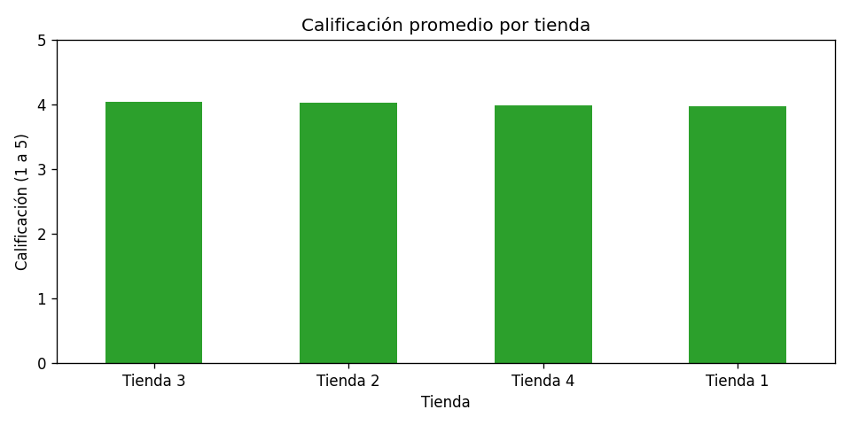
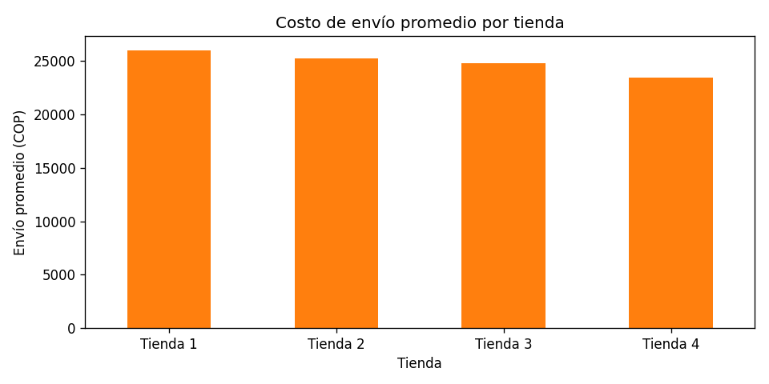

# Challenge Alura Store Latam — Análisis de Tiendas

## Descripción del proyecto

Análisis exploratorio de datos de las 4 tiendas de **Alura Store Latam** para apoyar la decisión del **Sr. Juan** sobre qué tienda debería vender, evaluando ingresos, categorías, satisfacción de clientes, productos y costos de envío.

**Dataset:** 4 archivos CSV con variables de producto, precio, envío, fecha, ubicación, calificación, método de pago y coordenadas geográficas.

---

## Estructura del repositorio

```
AluraStoreLatam.ipynb              ← Notebook con todo el análisis
base-de-datos-challenge1-latam/
    tienda_1 .csv
    tienda_2.csv
    tienda_3.csv
    tienda_4.csv
img/
    facturacion.png
    categorias.png
    calificacion.png
    envio.png
```

---

## Paso 1 — Análisis de facturación

Se calculó la suma total de la columna `Precio` por tienda.

| Tienda   | Facturación total (COP) |
|----------|------------------------|
| Tienda 1 | 1,150,880,400          |
| Tienda 2 | 1,116,343,500          |
| Tienda 3 | 1,098,019,600          |
| Tienda 4 | 1,038,375,700          |



> **Resultado:** La **Tienda 1** tiene la mayor facturación. La **Tienda 4** es la de menor ingreso total, con una brecha de ~112 millones COP respecto a la líder.

---

## Paso 2 — Ventas por categoría

Se contabilizaron las unidades vendidas por categoría para cada tienda y se graficaron las top 8 del consolidado.



> **Resultado:** **Muebles** es la categoría más vendida en el consolidado de todas las tiendas, seguida de Electrónicos. Las categorías con menor rotación son Instrumentos musicales y Artículos para el hogar.

---

## Paso 3 — Calificación promedio de la tienda

Se calculó la media de la columna `Calificación` (escala 1–5) por tienda.

| Tienda   | Calificación promedio |
|----------|-----------------------|
| Tienda 3 | 4.048                 |
| Tienda 2 | 4.037                 |
| Tienda 4 | 3.996                 |
| Tienda 1 | 3.977                 |



> **Resultado:** La **Tienda 3** lidera en satisfacción de clientes. La **Tienda 1** tiene la calificación más baja, aunque todas se mantienen cercanas a 4/5.

---

## Paso 4 — Productos más y menos vendidos

Se utilizó `value_counts()` sobre la columna `Producto` para identificar el artículo con mayor y menor frecuencia de venta en cada tienda.

| Tienda   | Más vendido                  | Uds. | Menos vendido              | Uds. |
|----------|------------------------------|------|----------------------------|------|
| Tienda 1 | Microondas                   | 60   | Auriculares con micrófono  | 33   |
| Tienda 2 | Iniciando en programación    | 65   | Juego de mesa              | 32   |
| Tienda 3 | Kit de bancas                | 57   | Bloques de construcción    | 35   |
| Tienda 4 | Cama box                     | 62   | Guitarra eléctrica         | 33   |

> **Resultado:** Cada tienda presenta un producto líder diferente. La diferencia entre el más y menos vendido es similar en todas las tiendas, sin que ninguna destaque por gestión de portafolio.

---

## Paso 5 — Envío promedio por tienda

Se calculó la media de la columna `Costo de envío` por tienda.

| Tienda   | Costo envío promedio (COP) |
|----------|---------------------------|
| Tienda 1 | 26,018.61                 |
| Tienda 2 | 25,216.24                 |
| Tienda 3 | 24,805.68                 |
| Tienda 4 | 23,459.46                 |



> **Resultado:** La **Tienda 4** tiene el costo de envío más eficiente. La **Tienda 1** tiene el costo más alto, lo que puede afectar su competitividad logística.

---

## Informe final — Recomendación para el Sr. Juan

### Introducción

El objetivo de este análisis fue comparar el desempeño de las 4 tiendas de Alura Store Latam para recomendar **qué tienda debería vender el Sr. Juan**. Se evaluaron cinco factores clave: facturación total, comportamiento por categorías, calificación promedio de clientes, productos más/menos vendidos y costo de envío promedio.

### Resumen comparativo de fortalezas y debilidades

| Factor                  | Tienda 1   | Tienda 2  | Tienda 3      | Tienda 4      |
|-------------------------|-----------|-----------|---------------|---------------|
| Facturación             | ✅ Mayor  | 2.º lugar | 3.er lugar    | ❌ Menor      |
| Calificación clientes   | ❌ Menor  | 2.º lugar | ✅ Mayor      | 3.er lugar    |
| Costo de envío          | ❌ Mayor  | 2.º lugar | 3.er lugar    | ✅ Menor      |
| Categoría líder (mix)   | Similar   | Similar   | Similar       | Similar       |
| Producto estrella       | Microondas| Libro prog.| Kit bancas   | Cama box      |

### Conclusión y recomendación

Con base en el análisis integral, la recomendación es que el Sr. Juan **venda la Tienda 4**.

**Justificación:**

1. **Menor facturación total** (~1,038 M COP): es el indicador de mayor peso financiero. La brecha frente a Tienda 1 supera los 112 millones de pesos, lo que representa una desventaja competitiva significativa.

2. **Sin liderazgo en satisfacción**: la única fortaleza que podría compensar una baja facturación sería una excelente experiencia del cliente, pero ese liderazgo lo tiene la Tienda 3 (4.048 vs 3.996 de Tienda 4).

3. **Ventaja logística insuficiente**: si bien Tienda 4 tiene el menor costo de envío promedio (~23,459 COP), esa eficiencia operativa no alcanza a cerrar la brecha de ingresos frente a las demás tiendas.

> **En síntesis:** la Tienda 4 es la candidata más coherente para desinversión. Al ponderar ingresos, experiencia del cliente y operación conjuntamente, no supera a ninguna de sus competidoras en los indicadores de mayor impacto. Venderla permitiría al Sr. Juan concentrar recursos en las tiendas con mejor desempeño.

---

*Análisis realizado con Python · pandas · matplotlib*
